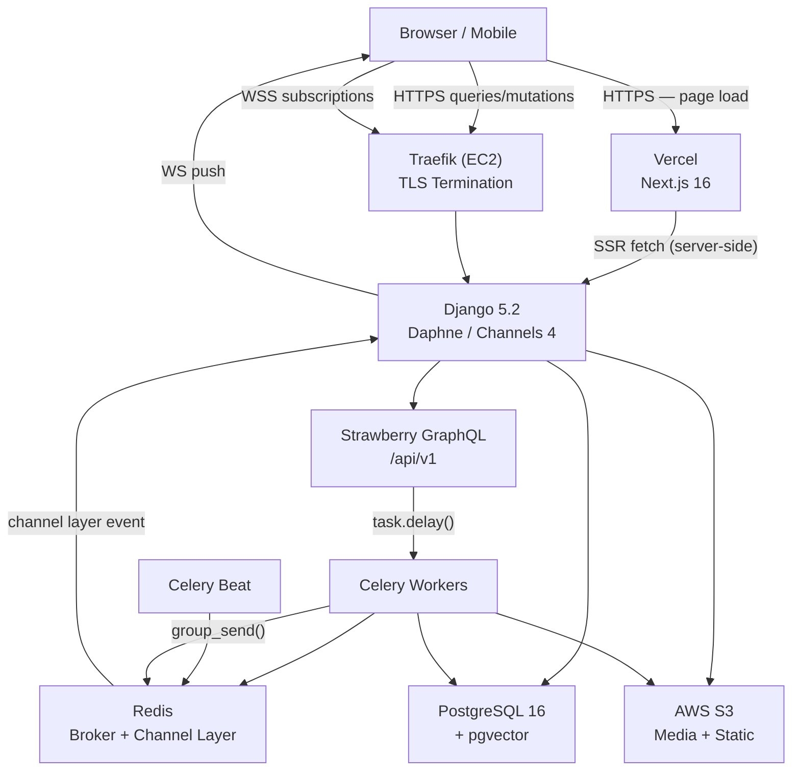

# 01 — Overview

## Architecture



**Key insight:** Next.js deploys to Vercel (git integration), while Django API runs in Docker Compose on a single EC2 instance behind Traefik. They share no Docker network — all communication goes over HTTPS/WSS via the public domain.

## Component roles

| Component | Technology | Role |
|-----------|-----------|------|
| Frontend | Next.js 16, React 19.2, MUI v9 | UI rendering; RSC for data fetching via Apollo; Client Components for interactivity and subscriptions; deployed to Vercel |
| API server | Django 5.2, Daphne, Channels 4.3 | ASGI entry point — handles HTTP GraphQL queries/mutations and WebSocket subscriptions on the same port |
| GraphQL layer | Strawberry 0.316, strawberry-graphql-django 0.86 | Schema assembly, resolver dispatch, Django model integration, N+1 optimisation via `DjangoOptimizerExtension` |
| Async workers | Celery 5.6, Redis | Background tasks — LLM calls, email dispatch, file processing, scheduled jobs |
| Beat scheduler | Celery Beat, django-celery-beat 2.9 | Periodic task scheduling stored in the database; registered via management command, not hardcoded |
| Channel layer | Redis (`channels_redis`) | Message bus between Celery workers and WebSocket subscription generators |
| Database | PostgreSQL 16 + pgvector | Primary relational store; pgvector for optional embedding search |
| Object storage | AWS S3 (`django-storages`) | Media uploads (S3Boto3Storage); static files in production |
| TLS / proxy | Traefik | Automatic Let's Encrypt TLS; routes `api.example.com` to the Django container |
| Infra | Terraform + EC2 + EIP | Single-instance deployment: VPC, security groups, elastic IP, S3 bucket, IAM roles |

## Monorepo layout

```
v1-mono/
├── api/                        # Django backend — Python, managed with uv
│   ├── pyproject.toml          # uv project manifest + Ruff formatter/linter config
│   ├── config/                 # Django project package (settings, asgi, celery, urls)
│   ├── apps/                   # Domain Django apps — models, admin, migrations ONLY
│   │   ├── authentication/
│   │   └── <domain>/
│   ├── logic/                  # Resolvers, tasks, email — imports from apps/, never the reverse
│   │   ├── queries/
│   │   ├── mutations/
│   │   ├── subscriptions/
│   │   ├── tasks/
│   │   └── email/
│   ├── graphql/                # Schema assembly, consumers, CORS middleware
│   ├── base/                   # BaseModel, BaseType, shared abstractions
│   └── utilities/              # S3 client, LLM client, email sender
├── ui/                         # Next.js frontend — TypeScript, Bun
│   ├── biome.json              # Biome v2 formatter + linter config
│   └── src/
│       ├── app/                # App Router: route groups, pages, layouts
│       │   ├── (auth)/         # Login, register, password reset
│       │   ├── (app)/          # Authenticated product UI
│       │   ├── (marketing)/    # Public pages
│       │   └── api/emails/     # React Email rendering route handlers
│       ├── client/             # Apollo client, Apollo providers
│       ├── components/         # Shared React components
│       ├── emails/             # React Email templates
│       └── __generated__/      # Output of graphql-codegen (committed)
├── .vscode/
│   ├── settings.json           # Format-on-save: Ruff (Python), Biome (TS/JS/JSON)
│   └── extensions.json         # Recommends ms-python, charliermarsh.ruff, biomejs.biome
├── .docker/
│   ├── development/
│   │   ├── docker-compose.yaml
│   │   ├── api/                # Dockerfile + entrypoint.sh (daphne)
│   │   ├── api-beat/           # entrypoint.sh (celery beat)
│   │   └── api-worker/         # entrypoint.sh (celery worker)
│   └── production/
│       ├── docker-compose.yaml
│       ├── api/
│       ├── api-beat/
│       └── api-worker/
├── .terraform/                 # Flat Terraform stack (main, networking, compute, storage)
├── .github/
│   └── workflows/
│       ├── ci.yml              # Type-check, lint, commitlint on PR
│       └── deploy.yml          # Build + push GHCR image → SSH deploy on push to main
└── scripts/
    ├── deploy.sh               # Runs docker compose pull + up on EC2 via SSH
    ├── graphql-sync.sh         # Exports schema from Django → copies to ui/ for codegen
    └── connect.sh              # Opens an SSH tunnel to the EC2 instance
```

## Shared conventions

| Convention | Pattern |
|------------|---------|
| **apps/ vs logic/** | `apps/` contains only models, admin, and migrations. All business logic, resolvers, and Celery tasks live in `logic/` — imports flow one-way (logic → apps, never apps → logic) |
| **Formatting** | Python: Ruff (`uv run ruff format . && uv run ruff check --fix .`) configured in `api/pyproject.toml`. TypeScript: Biome (`bunx biome check --apply .`) configured in `ui/biome.json`. Both apply automatically on save via `.vscode/settings.json` |
| **BaseModel** | Every domain model inherits `BaseModel`: UUID PK, `date_created`, `date_updated`, `date_deleted` (soft delete), `version` (optimistic concurrency) |
| **Schema export** | `python manage.py export_schema` writes `api/graphql/schema.graphql`; `scripts/graphql-sync.sh` copies it to `ui/` so `graphql-codegen` can run against it without a live server |
| **Codegen gate** | `tsc --noEmit` is blocked on codegen output — if the schema changes, types regenerate and compilation catches any frontend type errors |
| **Periodic tasks** | Registered in the `PeriodicTask` DB table via a management command called from the beat entrypoint — not hardcoded in settings, so they survive DB resets and are visible in Django admin |
| **Email cross-stack** | Celery task → Django POSTs to `ui/api/emails/<type>/route.ts` → React Email renders HTML → Django sends via Brevo (SendinBlue) |
| **Settings layering** | `common.py` → `development.py` / `production.py` / `ci.py`; selected via `DJANGO_SETTINGS_MODULE` env var |
| **Deployment split** | Frontend deploys to Vercel automatically on git push (no workflow step needed); backend deploys to EC2 via `deploy.yml` GitHub Actions workflow |

## Package versions (pinned)

| Package | Version |
|---------|---------|
| Python | 3.12 |
| Django | 5.2.x (LTS) |
| channels + daphne | 4.3.2 / 4.2.2 (`channels[daphne]`) |
| strawberry-graphql | 0.316.0 |
| strawberry-graphql-django | 0.86.0 |
| celery | 5.6.3 |
| django-celery-beat | 2.9.0 |
| uv | 0.11.19 |
| Bun | latest |
| Ruff | 0.15.x |
| Biome | 2.4.x |
| Next.js | 16 |
| React | 19.2 |
| @apollo/client | 4.2.2 |
| @apollo/client-integration-nextjs | latest (replaces `@apollo/experimental-nextjs-app-support`) |
| graphql-ws + rxjs | required peer deps for Apollo 4 subscriptions |
| @mui/material | 9.0.1 |
| @mui/material-nextjs | App Router SSR adapter |
| Terraform AWS provider | `~> 6.0` |
