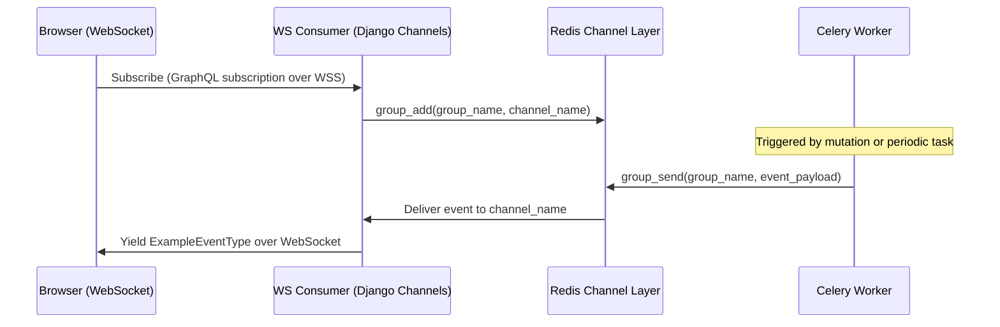

# 03 — Real-time: Django Channels + Redis

## Two-level ASGI routing

There are two variants in use across projects. Pick based on your auth requirements.

---

### Simple case: `GraphQLProtocolTypeRouter`

Strawberry provides a convenience router that handles both HTTP and WebSocket at `/api/v1`. Use this when you do not need custom auth middleware on WebSocket connections.

```python
# config/asgi.py (simple variant)
import os
from django.core.asgi import get_asgi_application
from strawberry.channels import GraphQLProtocolTypeRouter

os.environ.setdefault("DJANGO_SETTINGS_MODULE", "config.settings.development")

# Call get_asgi_application() before importing schema so django.setup() runs first.
django_asgi_app = get_asgi_application()

from graphql.schema import schema  # noqa: E402 — intentional late import

application = GraphQLProtocolTypeRouter(
    schema,
    django_application=django_asgi_app,
)
```

---

### Production variant: manual `ProtocolTypeRouter` + `AuthMiddlewareStack`

Use this when WebSocket connections need to carry authentication (JWT in `connectionParams`, session cookies, etc.). The `AuthMiddlewareStack` populates `request.user` on the WebSocket connection scope.

```python
# config/asgi.py (production variant)
import os
from django.core.asgi import get_asgi_application
from channels.auth import AuthMiddlewareStack
from channels.routing import ProtocolTypeRouter, URLRouter
from django.urls import re_path

os.environ.setdefault("DJANGO_SETTINGS_MODULE", "config.settings.production")
django_asgi_app = get_asgi_application()

from strawberry.channels import GraphQLHTTPConsumer, GraphQLWSConsumer  # noqa: E402
from graphql.schema import schema                                         # noqa: E402
from graphql.cors_middleware import CorsMiddleware                        # noqa: E402

# Wrap the HTTP consumer in a CORS middleware so GraphQL mutations from Vercel
# receive the correct Access-Control-Allow-Origin header.
gql_http = CorsMiddleware(
    AuthMiddlewareStack(
        GraphQLHTTPConsumer.as_asgi(schema=schema)
    )
)

# WebSocket consumer wrapped in AuthMiddlewareStack so info.context["request"].user
# is populated from the JWT passed in connectionParams.
gql_ws = AuthMiddlewareStack(
    GraphQLWSConsumer.as_asgi(schema=schema)
)

application = ProtocolTypeRouter({
    "http": URLRouter([
        re_path(r"^api/v1", gql_http),
        re_path(r"", django_asgi_app),     # Fallback to Django for admin, webhooks, etc.
    ]),
    "websocket": AuthMiddlewareStack(
        URLRouter([
            re_path(r"^api/v1", gql_ws),
        ])
    ),
})
```

## Channel layer configuration

```python
# config/settings/common.py
import os

CHANNEL_LAYERS = {
    "default": {
        "BACKEND": "channels_redis.core.RedisChannelLayer",
        "CONFIG": {
            "hosts": [(os.environ.get("CACHE_URL", "localhost"), 6379)],
        },
    }
}
```

```python
# config/settings/ci.py — no Redis required in CI runners
CHANNEL_LAYERS = {
    "default": {
        "BACKEND": "channels.layers.InMemoryChannelLayer",
    }
}

# Run Celery tasks synchronously in CI — no worker process needed
CELERY_TASK_ALWAYS_EAGER = True
CELERY_TASK_EAGER_PROPAGATES = True
```

## Pub/sub pattern

A Celery worker publishes an event to a named Redis group. The WebSocket subscription generator listens for messages on that group and yields them to the connected client.



### Subscription generator (logic side)

```python
# logic/subscriptions/example.py
from __future__ import annotations

import asyncio
from typing import AsyncGenerator
import strawberry
from strawberry.types import Info
from channels.layers import get_channel_layer
from asgiref.sync import async_to_sync

from logic.types import ExampleEventType
from logic.permissions.permissions import IsAuthenticated


@strawberry.type
class Subscription:
    @strawberry.subscription(permission_classes=[IsAuthenticated])
    async def on_example_event(
        self, info: Info, example_id: strawberry.ID
    ) -> AsyncGenerator[ExampleEventType, None]:
        """
        Yields events for the given example_id.

        The client subscribes with:
            subscription OnExample($id: ID!) {
                onExampleEvent(exampleId: $id) { id payload }
            }
        """
        group_name = f"example-{example_id}"
        channel_layer = get_channel_layer()
        ws = info.context["ws"]
        channel_name = ws.channel_name

        # Join the Redis group for this resource
        await channel_layer.group_add(group_name, channel_name)

        try:
            # Receive messages until the client disconnects
            while True:
                message = await asyncio.wait_for(
                    channel_layer.receive(channel_name),
                    timeout=30,  # yield None-equivalent heartbeat if silent
                )
                if message.get("type") == "example.event":
                    yield ExampleEventType(
                        id=message["id"],
                        payload=message["payload"],
                    )
        except asyncio.TimeoutError:
            # Reconnect or heartbeat — do not close the generator
            pass
        finally:
            # Always leave the group on disconnect
            await channel_layer.group_discard(group_name, channel_name)
```

### Task publish (worker side)

```python
# logic/tasks/example.py
from channels.layers import get_channel_layer
from asgiref.sync import async_to_sync
from celery import shared_task


def publish_example_event(example_id: str, payload: dict) -> None:
    """
    Sends an event to all WebSocket subscribers watching example_id.
    Call from any Celery task or signal handler.
    """
    group_name = f"example-{example_id}"
    layer = get_channel_layer()
    # async_to_sync bridges the synchronous Celery context into the async channel layer
    async_to_sync(layer.group_send)(
        group_name,
        {
            "type": "example.event",   # Matches message["type"] in the subscription generator
            "id": example_id,
            "payload": payload,
        },
    )


@shared_task(bind=True, acks_late=True, name="tasks.process_and_broadcast")
def process_and_broadcast(self, example_id: str) -> None:
    """
    Example task: do some work then broadcast the result to subscribers.
    """
    # ... processing ...
    result = {"status": "complete", "example_id": example_id}
    publish_example_event(example_id, result)
```

## WebSocket authentication

Clients pass a JWT token in `connectionParams` at subscription time:

```typescript
// ui/src/client/apollo-client.ts
const wsLink = new GraphQLWsLink(
  createClient({
    url: process.env.NEXT_PUBLIC_WS_URL!,
    connectionParams: async () => ({
      authorization: `Bearer ${await getAccessToken()}`,
    }),
  })
);
```

On the Django side, a middleware in `graphql/consumers.py` reads `connection_params["authorization"]`, validates the JWT, and attaches the user to the WebSocket scope so `info.context["request"].user` works identically to HTTP requests.

## Notes

- The `InMemoryChannelLayer` setting for CI avoids needing a Redis service in GitHub Actions — add `CELERY_TASK_ALWAYS_EAGER = True` alongside it.
- Group names are scoped by resource ID (e.g. `example-{uuid}`) — clients only receive events for resources they explicitly subscribe to.
- For high-cardinality subscriptions, consider namespacing groups further: `user-{user_id}-example-{example_id}`.
