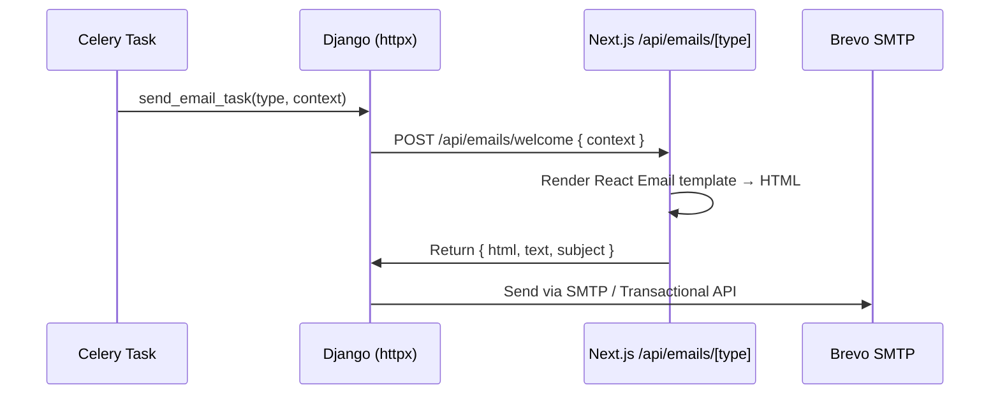

# 05 — Frontend: Next.js 16 + Apollo Client 4 + MUI v9

## Deployment

The frontend is **deployed to Vercel** via git integration — not part of Docker Compose. A push to `main` triggers Vercel's build pipeline automatically. No GitHub Actions workflow step is needed for the frontend.

Environment variables (`NEXT_PUBLIC_API_URL`, `NEXT_PUBLIC_WS_URL`, `SSR_API_URL`) are configured in the Vercel dashboard per environment (preview / production). They are **not** stored in `vercel.json`.

## App Router route groups

```
ui/src/app/
├── (auth)/                     # Unauthenticated pages
│   ├── login/page.tsx
│   ├── register/page.tsx
│   └── password-reset/page.tsx
├── (app)/                      # Authenticated product UI
│   ├── layout.tsx              # Auth guard, app shell
│   └── dashboard/page.tsx
├── (marketing)/                # Public landing pages
│   └── page.tsx
├── api/
│   └── emails/
│       └── [type]/
│           └── route.ts        # React Email renderer — called by Celery tasks
├── layout.tsx                  # Root layout: ApolloProvider, ThemeRegistry, fonts
└── globals.css
```

Route groups (`(auth)`, `(app)`, `(marketing)`) organise pages without affecting the URL — `(app)/dashboard/page.tsx` is served at `/dashboard`.

## Apollo Client 4 with `@apollo/client-integration-nextjs`

Apollo Client 4 replaces the former `@apollo/experimental-nextjs-app-support` with the stable `@apollo/client-integration-nextjs` package.

### Key patterns

| Pattern | API | When to use |
|---------|-----|------------|
| RSC data fetching | `registerApolloClient` + `getClient()` | Server Components, layout data, initial page data |
| Client Component queries | `ApolloNextAppProvider` + `useSuspenseQuery` | Interactive components needing reactive data |
| WebSocket subscriptions | `GraphQLWsLink` + `useSubscription` | Real-time updates from Channels |

### Split link setup

```typescript
// ui/src/client/apollo-client.ts — see sample/frontend/lib/apollo-client.ts
```

The split link routes:
- `query` and `mutation` → HTTP link (via `NEXT_PUBLIC_API_URL`)
- `subscription` → WebSocket link (via `NEXT_PUBLIC_WS_URL` using `graphql-ws`)

### Root layout wiring

```tsx
// ui/src/app/layout.tsx
import { ApolloWrapper } from "@/client/apollo-wrapper";
import { ThemeRegistry } from "@/components/ThemeRegistry";

export default function RootLayout({ children }: { children: React.ReactNode }) {
  return (
    <html lang="en">
      <body>
        {/*
          ApolloWrapper provides the Apollo client to all Client Components.
          ThemeRegistry provides MUI v9 theming with App Router SSR cache.
          Order matters: ThemeRegistry must be inside ApolloWrapper if it
          uses Apollo hooks for theme preferences.
        */}
        <ApolloWrapper>
          <ThemeRegistry>{children}</ThemeRegistry>
        </ApolloWrapper>
      </body>
    </html>
  );
}
```

### RSC data fetching (Server Components)

```tsx
// ui/src/app/(app)/dashboard/page.tsx
import { getClient } from "@/client/rsc-client";
import { GET_DASHBOARD_QUERY } from "@/__generated__/queries";

export default async function DashboardPage() {
  // getClient() returns a server-side Apollo client that does not persist to the browser.
  // Data is fetched at request time on the server and streamed to the client.
  const { data } = await getClient().query({ query: GET_DASHBOARD_QUERY });

  return <DashboardView data={data} />;
}
```

## MUI v9

MUI skipped v8 — jump directly from v7 to v9.

### Breaking changes from v7

| Feature | v7 / v6 | v9 |
|---------|---------|-----|
| Grid columns | `xs`, `sm`, `md`, `lg` props | `size` prop with object `{ xs: 12, md: 6 }` |
| Import path | `@mui/material/Grid` | `@mui/material/Grid` (same, but API changed) |
| SSR cache | `createCache()` (emotion) | `AppRouterCacheProvider` from `@mui/material-nextjs` |

### ThemeRegistry for App Router

```tsx
// ui/src/components/ThemeRegistry.tsx — see sample/frontend/components/ThemeRegistry.tsx
```

Wraps children with:
1. `AppRouterCacheProvider` — prevents Emotion style re-insertion on navigation
2. `ThemeProvider` — applies the custom MUI theme
3. `CssBaseline` — normalises browser styles

### Grid v9 example

```tsx
import Grid from "@mui/material/Grid";

// v9: use the `size` prop
<Grid container spacing={2}>
  <Grid size={{ xs: 12, md: 6 }}>Left panel</Grid>
  <Grid size={{ xs: 12, md: 6 }}>Right panel</Grid>
</Grid>
```

## Formatting and linting

Biome v2 replaces Prettier and ESLint with a single Rust-based tool. The config lives at `ui/biome.json`.

```json
// ui/biome.json — see sample/frontend/biome.json
```

Key choices:

| Setting | Value | Rationale |
|---------|-------|-----------|
| `formatter.indentStyle` | `"space"` | Matches TypeScript community convention |
| `formatter.lineWidth` | `100` | Slightly wider than Prettier's 80 for modern screens |
| `javascript.formatter.quoteStyle` | `"single"` | Consistent with Next.js/React convention |
| `javascript.formatter.trailingCommas` | `"es5"` | Trailing commas in objects/arrays, not function params |
| `vcs.useIgnoreFile` | `true` | Biome respects `.gitignore` — `node_modules/`, `.next/`, `__generated__/` are skipped automatically |
| `assist.actions.source.recommended` | `true` | Enables auto-fix import organisation on save |

**Common commands (run from `ui/`):**

```bash
bunx biome check .              # Lint + format check (CI)
bunx biome check --apply .      # Lint + format, apply safe fixes
bunx biome format --write .     # Format only
```

The VS Code Biome extension (`biomejs.biome`) reads `ui/biome.json` automatically when the workspace root contains the file, and applies format-on-save and inline lint diagnostics. Install it via `.vscode/extensions.json` recommendations.

> **Note on `@biomejs/biome` dev dependency:** Install Biome locally with `bun add --dev --save-exact @biomejs/biome` so the VS Code extension uses the same version as CI. The `--save-exact` flag pins to a specific version, preventing unexpected formatting diffs when Biome releases a new minor version.

## GraphQL codegen workflow

```typescript
// ui/codegen.ts — see sample/frontend/codegen.ts
```

```
Scripts (in package.json):
  "codegen"  → graphql-codegen --config codegen.ts
  "typecheck" → tsc --noEmit

Workflow:
  1. Edit Strawberry resolvers in api/logic/
  2. python manage.py export_schema graphql.schema --path graphql/schema.graphql
  3. ./scripts/graphql-sync.sh   (copies schema.graphql to ui/src/)
  4. bun run codegen              (regenerates ui/src/__generated__/)
  5. bun run typecheck            (catches any type drift)
  6. Commit schema.graphql and __generated__/ together
```

The codegen output is committed to the repository so CI does not need a running Django server to type-check.

## Email pattern: cross-stack rendering

Email HTML is rendered by the Next.js app using React Email, then delivered by Django via Brevo (SendinBlue).



```tsx
// ui/src/app/api/emails/[type]/route.ts
import { render } from "@react-email/render";
import { WelcomeEmail } from "@/emails/WelcomeEmail";
import { NextRequest, NextResponse } from "next/server";

const templates: Record<string, React.ComponentType<Record<string, unknown>>> = {
  welcome: WelcomeEmail as React.ComponentType<Record<string, unknown>>,
};

export async function POST(
  request: NextRequest,
  { params }: { params: Promise<{ type: string }> }
) {
  const { type } = await params;
  const context = await request.json();
  const Template = templates[type];

  if (!Template) {
    return NextResponse.json({ error: "Unknown template" }, { status: 404 });
  }

  const html = await render(<Template {...context} />);
  const text = await render(<Template {...context} />, { plainText: true });

  return NextResponse.json({ html, text });
}
```

## Key packages

```json
{
  "dependencies": {
    "next": "^16.0.0",
    "react": "^19.2.0",
    "react-dom": "^19.2.0",
    "@apollo/client": "^4.2.2",
    "@apollo/client-integration-nextjs": "latest",
    "graphql": "^16.0.0",
    "graphql-ws": "^6.0.0",
    "rxjs": "^7.0.0",
    "@mui/material": "^9.0.1",
    "@mui/material-nextjs": "^9.0.1",
    "@emotion/react": "^11.0.0",
    "@emotion/styled": "^11.0.0",
    "@react-email/render": "^1.0.0",
    "@react-email/components": "^0.0.25"
  },
  "devDependencies": {
    "@graphql-codegen/cli": "^5.0.0",
    "@graphql-codegen/client-preset": "^4.0.0",
    "typescript": "^5.0.0"
  }
}
```

> **Note on `rxjs`:** Apollo Client 4's WebSocket link depends on `rxjs` as a peer dependency. You must install it explicitly — it is not bundled.
